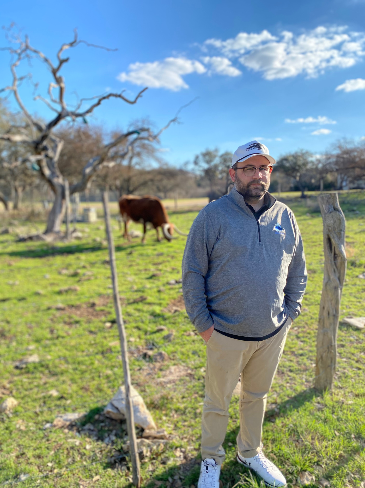

# Laissez les bons temps rouler y'all! 

- :computer: I do/manage Reliability Engineering & FinOps @ Outsystems
- :school_satchel: I’m currently studying astronomy and astrophysics.
- :busts_in_silhouette: I’m looking to collaborate on SRE, RE, and FinOps. HMU. PS...Im hiring! 
- 🤔 I’m looking for people who value emptathy & empowerment in engineering. 
- 💬 Ask me about team cultures, mentoring, and the SLOconf! 
- :bird: How to reach me: tweets @the_nickens





```yaml
apiVersion: apps/v1
kind: he/him/yall
metadata:
  annotations:
    deployment.kubernetes.io/revision: "1"
    prometheus.io/scrape: 'true'
    prometheus.io/port: '9072'
  creationTimestamp: 1984-xx-xx*01:37:55
  generation: 1
  labels:
    app: sre_alligator
  name: Zac Nickens
  selfLink: /apis/apps/v1/namespaces/default/deployments/sre_alligator
spec:
  progressDeadlineSeconds: 600
  replicas: 1
  revisionHistoryLimit: 10
  selector:
    matchLabels:
      app: sre_alligator
  strategy:
    rollingUpdate:
      maxSurge: 25%
      maxUnavailable: 25%
    type: RollingUpdate
  template:
    metadata:
      creationTimestamp: null
      labels:
        app: sre_alligator
    spec:
      containers:
        - name: zac_at_home
          value: 
            - Native New Orleanian
            - FAA Certified Remote Pilot
            - Dad to 3 cool kiddos
        - name: likes
          value: 
            - southern cuisine & cooking
            - golf
            - soccer
            - duck hunting
            - wrongfully judging other's gumbo
        - name: zac_at_work
          value: 
            - production engineering
            - site reliability engineer
            - antifragility & resilience
            - DevOps advocacy
            - geospatial systems engineering
```


